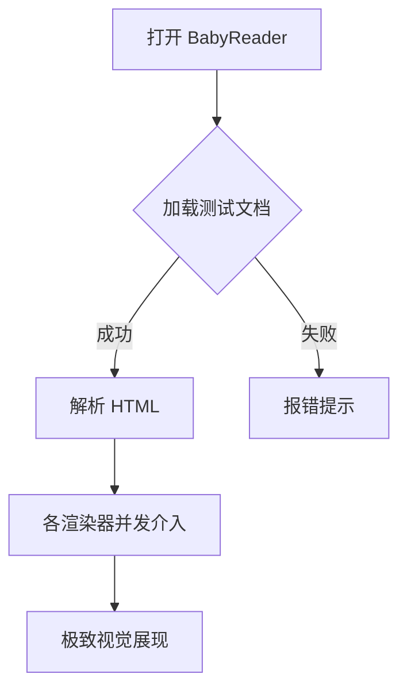
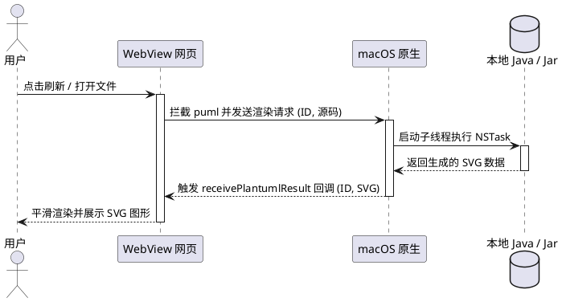

# Markdown 优化渲染与交互测试页面 (MPE Reference)

本文件用于全面测试 BabyReader 在 Markdown 渲染、公式展示、流程图绘制以及代码高亮等方面的优化表现。

## 1. 字体与基本排版测试

这里是一段普通的正文。我们优化了整体的字号比率、行高和行距，以便进行舒适的长文本阅读。
你可以在左侧的侧边栏中点击 **“宋”** 按钮将正文切换为优雅的**衬线宋体**，或者点击 **“系”** 按钮切回干净利落的无衬线系统字体。

> **读书名言**：读书破万卷，下笔如有神。这行文字位于一个全新设计、带有亮色左边框和细腻底色的引用块 (Blockquote) 中，以保证引用的视觉张力。

---

## 2. 任务列表与表格测试

- [ ] 这是一个未完成的任务列表项 (Task list item)
- [x] 这是一个已完成的任务列表项
- [ ] 支持 CSS 伪元素重绘的精美复选框交互

### 优化的数据表排版

| 功能模块 | 依赖技术库 | 本地离线支持 | 渲染质量评分 |
| :--- | :--- | :--- | :---: |
| 语法高亮 | Highlight.js | 🟢 支持 | 9.5 / 10 |
| 数学公式 | KaTeX | 🟢 支持 (CDN 降级字体) | 9.8 / 10 |
| 流程图 | Mermaid.js | 🟢 支持 | 9.2 / 10 |
| UML 建模 | PlantUML | 🟢 支持 (支持本地 Jar) | 9.5 / 10 |

---

## 3. 数学公式 (KaTeX) 测试

行内数学公式渲染：爱因斯坦著名质能方程为 $E = mc^2$，欧拉公式为 $e^{i\pi} + 1 = 0$。它们应该在行内无缝且美观地排版。

块级数学公式渲染：

$$
f(x) = \int_{-\infty}^{\infty} \hat{f}(\xi) e^{2\pi i x \xi} d\xi
$$

$$
\mathbf{V}_1 \times \mathbf{V}_2 =  \begin{vmatrix}
\mathbf{i} & \mathbf{j} & \mathbf{k} \\
\frac{\partial}{\partial x} & \frac{\partial}{\partial y} & \frac{\partial}{\partial z} \\
u & v & w
\end{vmatrix}
$$

---

## 4. Mermaid 流程图测试

通过 ` ```mermaid ` 语法，我们可以在页面中直接渲染出精美的流程图：



---

## 5. PlantUML 图表测试 (本地/在线双模式)

通过 ` ```puml ` 或 ` ```plantuml ` 语法，我们可以绘制 UML 时序图或类图。
你可以点击侧边栏的 **⚙️ 设置按钮**，输入本地的 `plantuml.jar` 路径并勾选“启用本地渲染”来测试离线运行。若未开启，将默认采用在线压缩编码进行在线解析：



---

## 6. 代码高亮测试

普通带有语法高亮的代码块（支持展示语言类型标签，并带有悬浮显示的“复制”按钮）：

```python
import os

def check_plantuml_jar(path):
    """
    检查本地 plantuml jar 文件是否存在
    """
    if os.path.exists(path) and path.endswith('.jar'):
        print(f"Found PlantUML jar at: {path}")
        return True
    return False

if __name__ == "__main__":
    jar_path = "/usr/local/bin/plantuml.jar"
    check_plantuml_jar(jar_path)
```

```javascript
// 测试一段经典的 JS 异步读取逻辑
async function fetchConfig(url) {
  try {
    const response = await fetch(url);
    const data = await response.json();
    return { success: true, data };
  } catch (error) {
    return { success: false, error: error.message };
  }
}
```
